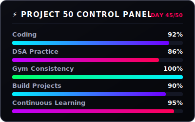
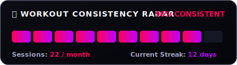
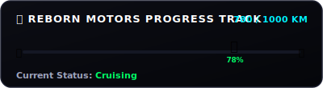
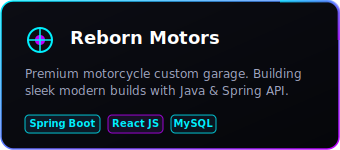
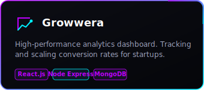
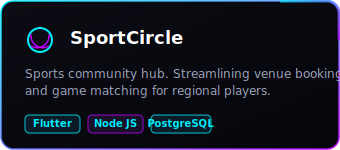
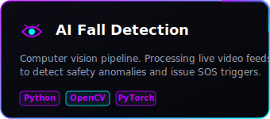

  
  <!-- Cyberpunk Hero Banner -->
  

    
  
  <!-- Typing SVG and Profile Frame Side-by-Side -->
  <table border="0" cellpadding="0" cellspacing="0" width="100%">
    <tr>
      <td width="25%" align="center" valign="middle">
        
      </td>
      <td width="75%" align="left" valign="middle">
        <h1>👋 Welcome to the Developer Command Center</h1>
        

          
        

      </td>
    </tr>
  </table>

## ⚡ Project 50 & Fitness Dashboard

<table border="0" cellpadding="10" cellspacing="0" width="100%">
  <tr>
    <td width="50%" valign="top" align="center">
      <!-- Project 50 Controller -->
      
    </td>
    <td width="50%" valign="top" align="center">
      <!-- Gym and Bike widgets stacked vertically -->
      
        
      
    </td>
  </tr>
</table>

## 👨💻 Developer Command Center Stats

<!-- STATS_START -->
<table>
  <tr>
    <td width="50%">
      <h3>💻 Wakatime Coding Stats</h3>
      <ul>
        <li><strong>Weekly hours:</strong> 32 hrs 40 mins</li>
        <li><strong>Daily average:</strong> 4 hrs 40 mins</li>
        <li><strong>Top language:</strong> Java (42.5%)</li>
        <li><strong>Second language:</strong> TypeScript (28.2%)</li>
      </ul>
    </td>
    <td width="50%">
      <h3>🧠 LeetCode DSA Metrics</h3>
      <ul>
        <li><strong>Total Solved:</strong> 342</li>
        <li><strong>Easy:</strong> 150 🟢</li>
        <li><strong>Medium:</strong> 162 🟡</li>
        <li><strong>Hard:</strong> 30 🔴</li>
      </ul>
    </td>
  </tr>
</table>
<!-- STATS_END -->

### 📈 Live GitHub Metrics

  
  

## 🏆 Achievement Garage

<table border="0" cellpadding="10" cellspacing="0" width="100%">
  <tr>
    <td width="50%" valign="top">
      
    </td>
    <td width="50%" valign="top">
      
    </td>
  </tr>
  <tr>
    <td width="50%" valign="top">
      
    </td>
    <td width="50%" valign="top">
      
    </td>
  </tr>
  <tr>
    <td width="50%" valign="top">
      
    </td>
    <td width="50%" valign="top" align="center" valign="middle">
      

        

          🚀  <strong>Next Project Loading...</strong> 
          Always pushing limits, building and learning daily.
        

      

    </td>
  </tr>
</table>

## 🎵 Now Playing

  <!-- Dynamic Spotify status widget -->
  

 

## 📬 Connect With Me

  
  
  

  

 

<!-- Neon Footer -->

  <pre>
 🌌 Cyberpunk Engine v1.0.0
 ┌──────────────────────────────────────────────┐
 │  while(alive) {                              │
 │      Code();                                 │
 │      Lift();                                 │
 │      Ride();                                 │
 │      Repeat();                               │
 │  }                                           │
 └──────────────────────────────────────────────┘
  </pre>

