  <!-- Boot Screen & Hero Header -->
  

 

  

 

## 👤 SYSTEM NODE: ABOUT ME

<table border="0" cellpadding="10" cellspacing="0" width="100%">
  <tr>
    <td width="50%" valign="top">
      <h3>👨‍💻 Developer Profile</h3>
      <ul>
        <li><strong>Who I Am:</strong> A passionate full-stack developer specializing in creating scalable backend systems and responsive UI models.</li>
        <li><strong>Core Focus:</strong> Writing clean code, optimizing database structures, and mastering algorithms.</li>
        <li><strong>Career Objective:</strong> Actively seeking a software engineering internship to contribute to production environments.</li>
      </ul>
       
      

        <!-- Floating Tech Icons Animation -->
        
      

    </td>
    <td width="50%" valign="top" align="center">
      <!-- Animated Coding Journey Timeline -->
      
    </td>
  </tr>
</table>

 

  

 

## 📊 LIVE DASHBOARD: SYSTEM METRICS

<table border="0" cellpadding="10" cellspacing="0" width="100%">
  <tr>
    <td width="50%" valign="top" align="center">
      <!-- Live Command Center status bars -->
      
    </td>
    <td width="50%" valign="top" align="center">
      <!-- VS Code style Build Status widget -->
      
    </td>
  </tr>
</table>

 

  

 

## 🛠️ TECH STACK CONVEYOR & SKILL RADAR

  <!-- Animated Tech Stack Conveyor Belt (Scrolling) -->
  

 

<table border="0" cellpadding="10" cellspacing="0" width="100%">
  <tr>
    <td width="50%" valign="top" align="center">
      <!-- Expanding Skill Radar Chart -->
      
    </td>
    <td width="50%" valign="top" align="center">
      <!-- Cycling Laptop Screen Animation -->
      
    </td>
  </tr>
</table>

 

  

 

## 🚀 FEATURED PROJECTS

Only repositories from my GitHub, auto-generated with hover-glow cards:

<!-- PROJECTS_START -->
<table border="0" cellpadding="0" cellspacing="0" width="100%">
  <tr>
    <td width="50%" valign="top">
      
    </td>
    <td width="50%" valign="top">
      
    </td>
  </tr>
  <tr>
    <td width="50%" valign="top">
      
    </td>
    <td width="50%" valign="top">
      
    </td>
  </tr>
</table>
<!-- PROJECTS_END -->

 

  

 

## 📈 SYSTEM ARCHITECTURE & ANALYTICS

  <!-- Animated System Architecture diagram -->
  

  

<table border="0" cellpadding="10" cellspacing="0" width="100%">
  <tr>
    <td width="50%" valign="top" align="center">
      <!-- LeetCode Solved & Contest metrics dashboard -->
      
    </td>
    <td width="50%" align="center">
      
        
      
    </td>
  </tr>
</table>

 

  <h3>👾 GitHub Contribution Snake Game</h3>
  <!-- Platane Snake game contribution grid (generated daily) -->
  <picture>
    <source media="(prefers-color-scheme: dark)" srcset="https://raw.githubusercontent.com/Shafiq-11/shafiq-11/output/github-contribution-grid-snake-dark.svg">
    <source media="(prefers-color-scheme: light)" srcset="https://raw.githubusercontent.com/Shafiq-11/shafiq-11/output/github-contribution-grid-snake.svg">
    
  </picture>

 

  

 

## 🏆 ACHIEVEMENTS & CERTIFICATIONS

<table border="0" cellpadding="10" cellspacing="0" width="100%">
  <tr>
    <td width="50%" valign="top">
      <h3>🏅 Honors</h3>
      <ul>
        <li>🏆 <strong>Hackathons:</strong> Participated in developer challenges to build functional web applications.</li>
        <li>🥇 <strong>Contest Solved:</strong> Completed over 340+ LeetCode &amp; DSA logic problems.</li>
        <li>🌐 <strong>Open Source:</strong> Committing patches and documentation fixes in public repositories.</li>
      </ul>
    </td>
    <td width="50%" valign="top">
      <h3>🏆 Active Certifications</h3>
      <table border="0" cellpadding="5" cellspacing="0" width="100%">
        <thead>
          <tr style="border-bottom: 1.5px solid var(--border);">
            <th align="left">Year</th>
            <th align="left">Title</th>
            <th align="left">Issuer</th>
          </tr>
        </thead>
        <tbody>
          <tr>
            <td>2025</td>
            <td>Java SE Programming</td>
            <td>Oracle (Placeholder)</td>
          </tr>
          <tr>
            <td>2025</td>
            <td>Spring Boot Microservices</td>
            <td>Udemy (Placeholder)</td>
          </tr>
          <tr>
            <td>2026</td>
            <td>React Ecosystem</td>
            <td>Coursera (Placeholder)</td>
          </tr>
        </tbody>
      </table>
    </td>
  </tr>
</table>

 

  

 

## 📬 SYSTEM CONTACT NODE

  
  
  

 

  <!-- System visitors counter -->
  

 

  

 

## 🔌 TERMINAL SHUTDOWN SEQUENCE

  <!-- Interactive terminal simulation logging shutdown steps -->
  

